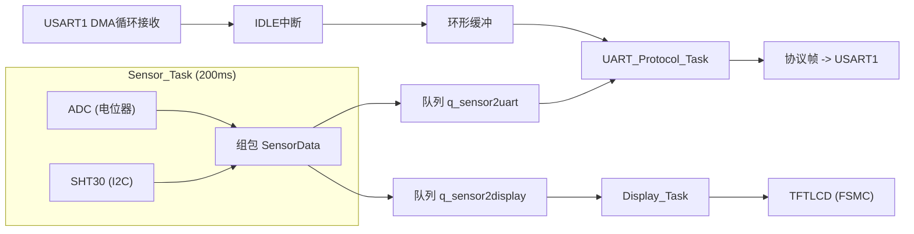

# STM32 FreeRTOS 数据采集与通信节点


-green)

-lightgrey)

基于 STM32F103ZET6 与 FreeRTOS 的多任务嵌入式数据采集与通信节点：
通过 I2C 读取 SHT30 温湿度、ADC 采集模拟电压，数据经自定义协议帧（DMA + IDLE + CRC16）
与上位机交互，参数掉电保存于内部 Flash，并实时显示在 TFTLCD 上。

## 功能特性

- **三任务 + 队列解耦**：Sensor / UART_Protocol / Display 三个任务，数据经消息队列传递
- **无阻塞串口接收**：DMA 循环搬运 + IDLE 中断切帧 + 环形缓冲（单生产者/单消费者，无需加锁）
- **自定义协议**：帧头 + ID + CMD + LEN + DATA + CRC16-MODBUS，状态机解析、坏帧自动丢弃
- **参数掉电保存**：设备 ID / 采样周期存入内部 Flash（末扇区 + CRC 校验），开机自动恢复
- **LCD 实时显示**：FSMC 驱动 TFTLCD，静态框架 + 变化刷新，无闪烁
- **命令应答闭环**：支持设置参数、查询设备信息，串口助手可在线调试

## 系统架构



## 硬件清单

| 模块 | 接口 | 说明 |
|------|------|------|
| STM32F103ZET6 最小系统板 | - | 主控 |
| SHT30 温湿度传感器 | I2C1（PB6/PB7） | 7 位地址 0x44 |
| 电位器 | ADC1_IN1（PA1） | 12 位，3.3V 参考 |
| TFTLCD（MCU 屏） | FSMC（NE4 + A10） | 8080 并口，16 位数据线 |
| USB 转串口 | USART1（PA9/PA10） | 115200-8-N-1 |

## 通信协议

```
| 0xAA(帧头) | ID | CMD | LEN | DATA[LEN] | CRC16(2B, 低字节在前) |
```

CRC16-MODBUS 覆盖 ID + CMD + LEN + DATA 字段。

| CMD | 方向 | 功能 |
|-----|------|------|
| 0x01 | 上行 | 主动上报传感器数据（ADC 电压 + 温度 + 湿度） |
| 0x02 | 下行 | 设置参数（采样周期、设备 ID），成功后掉电保存 |
| 0x03 | 下行 | 查询设备信息（固件版本、设备 ID） |

示例（HEX 发送）：查询设备信息 `AA 01 03 00 20 F0`；设置采样周期 100ms `AA 01 02 03 01 00 64 28 65`。

## 开发记录（M0 ~ M5）

| 阶段 | 内容 | 关键收获 |
|------|------|----------|
| M0 | 项目规划 | 垂直切片里程碑、按需学习外设 |
| M1 | 最小闭环（ADC -> 队列 -> 串口） | 修复 Strict ANSI 导致的 #667、MicroLIB/semihosting 启动崩溃 |
| M2 | UART 接收（DMA + IDLE + 环形缓冲） | 无阻塞接收、粘包切帧、单生产者单消费者无锁 |
| M3 | 协议帧 + CRC16 | 三态状态机自动同步、查表法校验 |
| M4 | SHT30 + Flash 掉电保存 | I2C 时序、Flash 扇区地址修正、参数 CRC 校验 |
| M5 | TFTLCD 移植（FSMC） | 驱动移植四坑、界面防闪烁 |

## 目录结构

```text
FreeRTOS_Project/
├── Inc/            # 头文件（含自定义模块）
├── Src/            # 源码（含 ringbuf / crc16 / protocol / sht30 / flash_param / lcd）
├── Middlewares/    # FreeRTOS 内核
├── Drivers/        # HAL 库 + CMSIS
├── MDK-ARM/        # Keil 工程
└── docs/           # 项目复盘 + 面试问答文档
```

## 快速开始

1. 使用 Keil MDK 打开 `MDK-ARM/FreeRTOS_Project.uvprojx`
2. 按 README 硬件清单接线
3. 编译下载（注意开启 **Use MicroLIB**，否则 printf 会因 semihosting 崩溃）
4. 串口助手 115200，HEX 模式观察上报帧，发送协议命令交互

## 测试验证

- 采样周期修改后上报频率实时变化（命令生效）
- 修改设备 ID 后复位重启，参数仍然保留（Flash 掉电保存）
- 发送错误 CRC 帧，系统静默丢弃并计数（协议容错）
- LCD 显示温湿度 / ADC / 设备 ID，数值变化才刷新（无闪烁）

## 许可证

学习交流用途。正点原子 LCD 驱动版权归正点原子所有。
