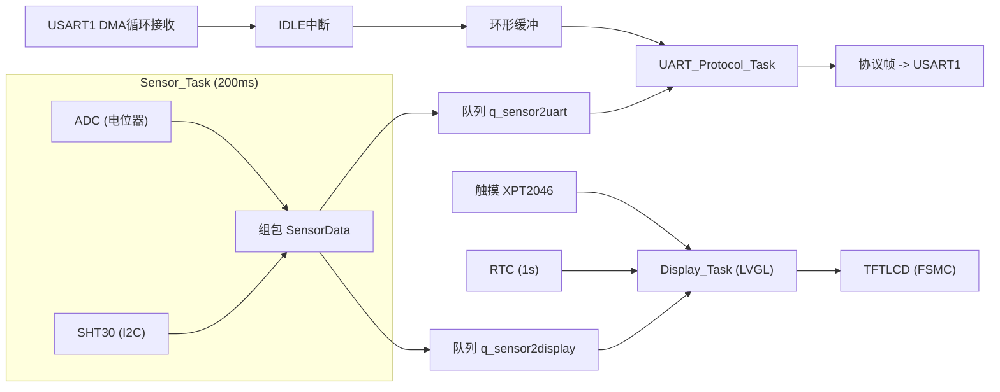

# STM32F103 + FreeRTOS 传感器采集 + LVGL 桌面系统


-green)

-lightgrey)

-lightgrey)

基于 STM32F103ZET6 + FreeRTOS 的多任务嵌入式**数据采集与通信节点 + LVGL 桌面系统**：
底层通过 I2C 读取 SHT30 温湿度、ADC 采集模拟电压，数据经自定义协议帧（DMA + IDLE + CRC16）与上位机交互，参数掉电保存于内部 Flash；
上层是一个"类手机"桌面——开机进入彩色图标桌面，触摸点击进入时钟 / 温湿度 / ADC / 计算器四个 App，页面切换带淡入动画。

工程框架由 STM32CubeMX 生成（HAL 库），任务调度、协议状态机、环形缓冲、CRC16、传感器驱动、触摸与 LCD 移植等应用层代码均为手写。

对简历的一句话讲法：**基于 STM32F103 + FreeRTOS + LVGL 的多任务传感器桌面系统 —— 触摸交互、多页面切换、实时数据刷新全都有。**

## 功能特性

- **三任务 + 队列解耦**：Sensor / UART_Protocol / Display 三个任务，数据经消息队列传递
- **无阻塞串口接收**：DMA 循环搬运 + IDLE 中断切帧 + 环形缓冲（单生产者/单消费者，无需加锁）
- **自定义协议**：帧头 + ID + CMD + LEN + DATA + CRC16-MODBUS，状态机解析、坏帧自动丢弃
- **参数掉电保存**：设备 ID / 采样周期存入内部 Flash（末扇区 + CRC 校验），开机自动恢复
- **LVGL 桌面 UI**：手机风格桌面（2×2 彩色圆角图标 + 状态栏时间）、FADE_ON 页面切换动画、页面常驻切换零延迟
- **四个真实数据 App**：时钟（RTC，LSE + VBAT 掉电续走）、温湿度（大字 + 60s 滑动曲线）、ADC（实时电压）、计算器（优先级/小数/退格/除零报错）
- **电阻触摸**：XPT2046，校准数据存 AT24C02，开机自动加载
- **命令应答闭环**：支持设置参数、查询设备信息，串口助手可在线调试

## 系统架构



UI 层内部结构：

```
Display_Task (8KB 栈 + LVGL)
 ├─ lcd_init()        FSMC 驱动 2.8" TFTLCD (240x320, 16bpp)
 ├─ lv_init()         LVGL 8.2 (LV_MEM 16KB)
 ├─ rtc_init()        RTC 实时时钟(LSE), 首次上电自动用编译时间初始化
 ├─ tp_init()         触摸校准加载
 └─ 桌面 + 4 个 App 页(lv_scr_load_anim 切换)

数据流:
Sensor_Task (200ms) ──队列──> Display_Task ──> 温湿度大字 + 曲线 + ADC 大字
RTC (1s 中断可读)   ──────> Display_Task ──> 时钟页 + 桌面状态栏时间
触摸 (XPT2046)      ──────> lv_port_indev ──> LVGL 事件 → 图标点击 / 按键

页面全部常驻内存(创建一次, lv_scr_load 切换), 切换零延迟、无重建开销。
```

## 硬件清单

| 模块 | 接口 | 说明 |
|------|------|------|
| STM32F103ZET6 最小系统板 | - | 主控（64KB SRAM / 512KB Flash） |
| SHT30 温湿度传感器 | I2C1（PB6/PB7） | 7 位地址 0x44，软件模拟 I2C 驱动 |
| 电位器 | ADC1_IN1（PA1） | 12 位，3.3V 参考 |
| TFTLCD（MCU 屏） | FSMC（NE4 + A10） | 8080 并口，16 位数据线，2.8" 240x320 |
| 电阻触摸 XPT2046 | 软件 SPI（PB1/PB2/PF9/PF10/PF11） | 校准数据存 AT24C02 |
| RTC 时钟 | LSE 32.768kHz + VBAT | 掉电续走 |
| USB 转串口 | USART1（PA9/PA10） | 115200-8-N-1 |

## 通信协议

```
| 0xAA(帧头) | ID | CMD | LEN | DATA[LEN] | CRC16(2B, 低字节在前) |
```

CRC16-MODBUS 覆盖 ID + CMD + LEN + DATA 字段。

| CMD | 方向 | 功能 |
|-----|------|------|
| 0x01 | 上行 | 主动上报传感器数据（ADC 电压 + 温度 + 湿度） |
| 0x02 | 下行 | 设置参数（采样周期、设备 ID），成功后掉电保存 |
| 0x03 | 下行 | 查询设备信息（固件版本、设备 ID） |

示例（HEX 发送）：查询设备信息 `AA 01 03 00 20 F0`；设置采样周期 100ms `AA 01 02 03 01 00 64 28 65`。

## 功能演示清单

| # | 功能 | 说明 |
|---|------|------|
| 1 | 手机风格桌面 | 2×2 彩色圆角图标（渐变+阴影），右上角状态栏时间 `HH:MM` |
| 2 | 页面切换动画 | FADE_ON 200ms 淡入，切换流畅无闪烁 |
| 3 | 时钟 App | RTC（LSE 32.768kHz + VBAT 掉电续走）显示 `HH:MM:SS` + 日期星期 |
| 4 | 温湿度 App | SHT30 大字实时显示 + 60s 滑动曲线（自适应 Y 轴，0.1°C 分辨率） |
| 5 | ADC App | 电位器电压大字显示 + 原始值 |
| 6 | 计算器 App | 加减乘除、优先级、小数、%、退格、除零报 Error |
| 7 | 电阻触摸 | XPT2046，校准数据存 AT24C02，开机自动加载 |

## LVGL 移植要点（踩坑记录）

这套移植踩过的坑，换板子移植可对照避雷：

1. **触摸 `tp_scan()` 返回值恒为 0（正点原子例程 bug）**
   `tp_scan()` 返回类型是 `uint8_t`，但内部 `return tp_dev.sta & TP_PRES_DOWN`（0x8000）会被截断成 0 —— **判断按下必须查 `tp_dev.sta`，不能信返回值**。见 `Src/lv_port_indev.c`。

2. **软件延时精度（SPI 位错乱）**
   XPT2046 读取需要 1µs 级延时，NOP 循环在 72MHz 下偏短导致 AD 值 >4095（位错位）。改用 **DWT 周期计数器** 做精确 `delay_us()`，见 `Src/lcd.c`。

3. **btnmatrix 行分隔符 `"\n"`**
   LVGL 8.2 的 `lv_btnmatrix_set_map()` 必须用 `"\n"` 字符串当行分隔符，否则 20 个按钮全挤一行（显示乱码）。见计算器的 `calc_map`。

4. **`lv_snprintf` 不支持浮点**
   该版本 `LV_SPRINTF_USE_FLOAT=0`，`%.10g`/`%f` 格式无效（结果不显示）。需要自己写整数/小数分离格式化（见 `calc_format_result`），或改用定点运算。

5. **动画类型名是 `LV_SCR_LOAD_ANIM_FADE_ON`**
   不是 LVGL 9 的 `FADE_IN`。MOVE_LEFT 动画在低端屏会一帧渲染两屏，改用 FADE_ON 流畅很多。

6. **显示缓冲越大动画越流畅**
   `DISP_BUF_SIZE = 320*16`（单个缓冲，LVGL 8.2 支持单缓冲模式）。

7. **RTC 在精简 HAL 里缺宏**
   移植 F1 RTC 时 `__HAL_PWR_ENABLE_BKUPACCESS`/`__HAL_RCC_LSE_ENABLE` 在精简库中不存在，用寄存器等价写法 `SET_BIT(PWR->CR, PWR_CR_DBP)` / `SET_BIT(RCC->BDCR, RCC_BDCR_LSEON)`。

8. **注释/编码统一为 UTF-8**
   ARMCC5 编译 UTF-8 中文注释无问题；GBK/UTF-8 混用会在串口输出乱码。所有源文件已统一 UTF-8。

## 内存配置（64KB SRAM 预算是关键）

| 项 | 配置 | 说明 |
|----|------|------|
| LV_MEM_SIZE | 16KB | 实测峰值 ~10.2KB，余量充足 |
| 显示缓冲 | 320×16×2B ≈ 10KB | 静态数组，不占 LV_MEM |
| 总 ZI | ~57.5KB / 64KB | 余 ~6.5KB |
| 字体 | montserrat 14 / 16 / 20 | 含 LV_SYMBOL 符号区间 |

优化手段：共享样式（4 个图标共用一套 style 对象）、页面常驻复用、值变化才刷新 label（避免无效重绘）、字符串用静态缓冲。

**中文显示可行性**：16px 全字库约 270KB Flash（6763 常用字），SRAM 增加很小；当前 512KB Flash 完全放得下，只差一个字库转换工具。本项目暂未启用。

## 触摸接线（XPT2046，电阻屏）

| 触摸信号 | STM32 引脚 | 备注 |
|----------|-----------|------|
| T_CLK | PB1 | 软件 SPI 时钟 |
| T_CS | PF11 | 片选 |
| T_MISO | PB2 | 数据读 |
| T_MOSI | PF9 | 命令/数据写 |
| T_PEN | PF10 | 按下中断检测 |

校准数据存 **AT24C02**（软件 I2C），开机自动加载，无需每次校准。

> ⚠️ 屏标注"电容屏"可能实为电阻屏 —— 移植前先跑官方例程确认芯片 ID，别信外壳标签（本项目的真实踩坑）。

## 开发记录（M0 ~ M6）

| 阶段 | 内容 | 关键收获 |
|------|------|----------|
| M0 | 项目规划 | 垂直切片里程碑、按需学习外设 |
| M1 | 最小闭环（ADC -> 队列 -> 串口） | 修复 Strict ANSI 导致的 #667、MicroLIB/semihosting 启动崩溃 |
| M2 | UART 接收（DMA + IDLE + 环形缓冲） | 无阻塞接收、粘包切帧、单生产者单消费者无锁 |
| M3 | 协议帧 + CRC16 | 三态状态机自动同步、查表法校验 |
| M4 | SHT30 + Flash 掉电保存 | 软件模拟 I2C（硬件外设不产生时钟）、Flash 扇区地址修正、参数 CRC 校验 |
| M5 | TFTLCD 移植（FSMC） | 驱动移植四坑、界面防闪烁 |
| M6 | LVGL 桌面系统（触摸 + RTC + 4 App） | 移植踩坑 8 条见上、LV_MEM 16KB 预算、页面常驻切换 |

## 目录结构

```text
FreeRTOS_Project/
├── Inc/            # 头文件（lv_conf.h, touch.h, rtc.h, protocol.h ...）
├── Src/            # 源码（freertos.c 任务+UI, lv_port_disp/indev, touch, rtc, sht30, lcd ...）
├── Drivers/        # HAL 库 + CMSIS
├── Middlewares/    # FreeRTOS + LVGL 8.2
├── MDK-ARM/        # Keil 工程
└── README.md       # 项目说明
```

## 快速开始

1. 使用 Keil MDK 打开 `MDK-ARM/FreeRTOS_Project.uvprojx`
2. 按 README 硬件清单接线
3. 编译下载（注意开启 **Use MicroLIB**，否则 printf 会因 semihosting 崩溃）
4. 串口助手 115200，HEX 模式观察上报帧，发送协议命令交互；LCD 上触摸操作桌面
5. 命令行构建：`UV4.exe -r -j0 -o build_log.txt FreeRTOS_Project.uvprojx`，产物在 `MDK-ARM/FreeRTOS_Project.hex`

## 测试验证

- 采样周期修改后上报频率实时变化（命令生效）
- 修改设备 ID 后复位重启，参数仍然保留（Flash 掉电保存）
- 发送错误 CRC 帧，系统静默丢弃并计数（协议容错）
- 桌面四个 App 实时数据：温湿度 / ADC 大字 + 曲线随传感器变化
- 触摸点击图标进出 App，页面切换动画正常
- RTC 时间掉电续走（VBAT），触摸校准数据 AT24C02 开机自动加载

## 许可证

学习交流用途。正点原子 LCD 驱动版权归正点原子所有。
